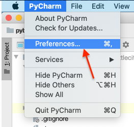
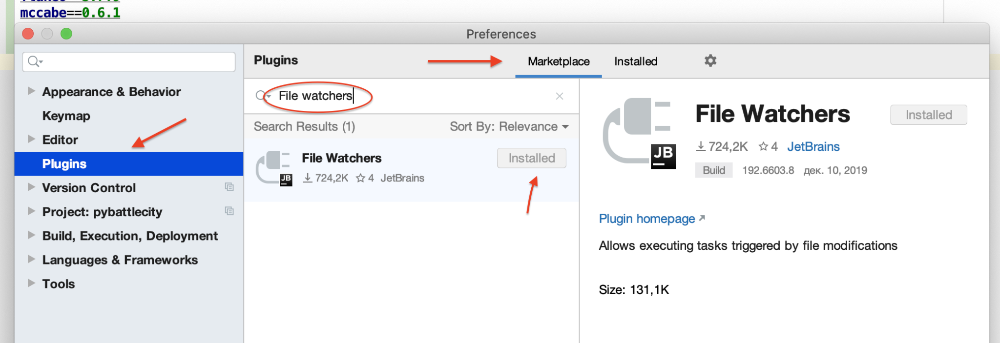
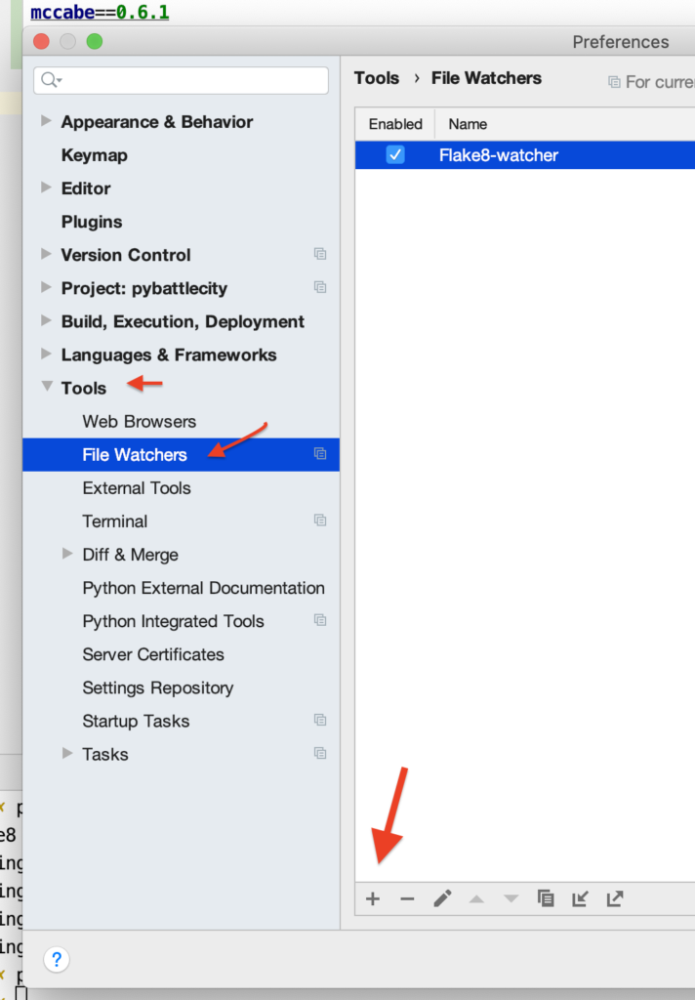
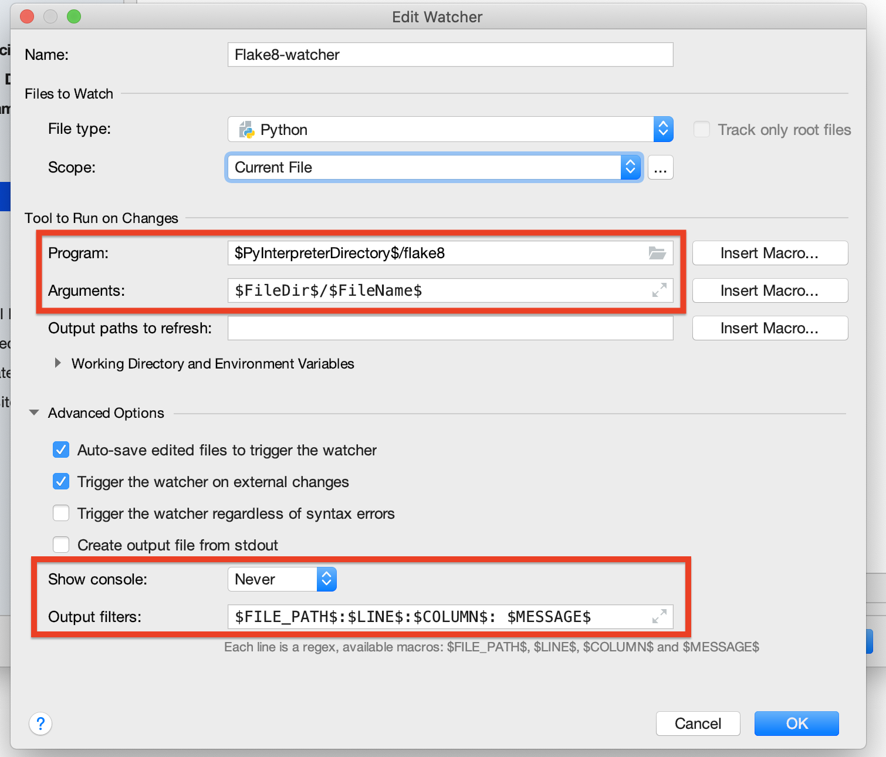
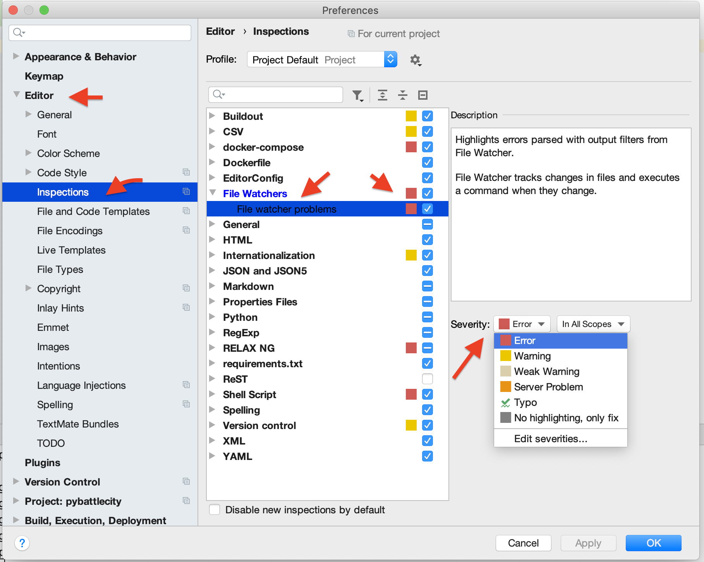

# PyCharm + Flake8

*This description is based on https://tirinox.ru/flake8-pycharm/ (translated using Google Translate, then slightly modified).*

## 1. Install File Watcher Plugin

You must have the File Watcher plugin installed. It's the official plugin, but it's not always loaded by default. Go to the settings (on Mac - *PyCharm menu* - *Preferences*, on other systems look in the *File* menu).

There, we go to *Plugins* - *Marketplace* - find and select *File Watchers* - *Install*. Then, restart IDE.

## 2. Configure File Watcher

We need the IDE to watch for changes when editing a file and run it through the Flake8 file if something has changed. To do this, you need to create a File Watcher -- a watchdog that will execute the command.

In the same place, in the settings, go to *Tools* - *File Watches* - click on the plus sign.

Next, we set up the file watcher. You can come up with any name. Other settings:

  1. File type: Python
  2. Score: Current File (in order to consume less resources and energy; it's also possible to opt for the whole project)
  3. Program: `$PyInterpreterDirectory$/flake8`
  4. Arguments: `$FileDir$/$FileName$`
  5. Show console: Never (we will never show the console, and errors should be underlined right in the code!)
  6. Output filters is the format of the error string that flake8 throws when it finds stylistic problems. Using this format, the IDE will understand exactly where the problem occurred (file, line, column, message). Copy this: `$FILE_PATH$:$LINE$:$COLUMN$: $MESSAGE$`

## 3. Displaying stylistic issues in the code

Now we need to get PyCharm to highlight issues in the right places in the code. This is easy to do, you need to enable the appropriate inspection.

In the settings, we are looking for: *Editor* - *Inspections* - *File Watchers* - *File Watcher Problems* - there should be a check mark, then select *Severity: Error* to the right. Click OK and you're done!

Congratulations. Start editing the file and see if there are any stylistic problem messages:

