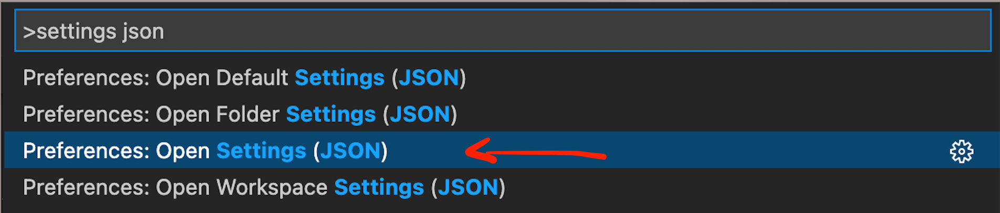

# VSCode

Our preferred IDE for python is [Visual Studio Code](https://code.visualstudio.com/).

## Installation

To download and install VSCode on macOS follow the instructions [here](https://code.visualstudio.com/docs/setup/mac).

## User interface

The layout image and information are taken from [this](https://code.visualstudio.com/docs/getstarted/userinterface) page where you can read about the user interface in more detail.

### Layout


The UI is divided into five areas:

 - Editor - The main area to edit your files. You can open as many editors as you like side by side vertically and horizontally.
 - Side Bar - Contains different views like the Explorer to assist you while working on your project.
 - Status Bar - Information about the opened project and the files you edit.
 - Activity Bar - Located on the far left-hand side, this lets you switch between views and gives you additional context-specific indicators, like the number of outgoing changes when Git is enabled.
 - Panels - You can display different panels below the editor region for output or debug information, errors and warnings, or an integrated terminal. Panel can also be moved to the right for more vertical space.

### Command Palette

Command palette (`Cmd+Shift+P` or `F1`) is where you can find all available (both core and extensions) commands in VSCode. It acts as a search so you can simply type keywords of the command you want to use.

For example, if we want to access the JSON version of settings we simply type `settings json`. The third entry is for the global settings, and it is the one we use for configuration.

<!--  -->



## Configuration


### Extensions

The strength and flexibility of VSCode are in the use of extensions. These are add-ons that unlock more features. The following are three lists of extensions; *Required*, *Recommended*, and *Suggested*. There are many more useful extensions not covered in this document.

**Required**
 - Python

**Recommended**
 - Python Docstring Generator
 - Python Test Explorer
 - Remote - SSH

**Suggested**
 - GitHub Pull Requests and Issues
 - GitLens
 - Latex Workshop
 - Code Spell Checker
 - Todo Tree

### Settings

Settings can be configured using UI or modifying the settings (JSON) file. Here we show the latter. 

**General and python extension**

```JSON
{
    "terminal.integrated.inheritEnv": false,
    "editor.rulers": [80, 120],
    "editor.formatOnSave": true,
    "python.formatting.provider": "black",
    "python.linting.flake8Enabled": true,
}
```

 - To use lining and formatting in python files using `black` and `flake8` select the python environment which has those libraries installed. The selected interpreter is shown on the left side of the *Status Bar* and changing it can be done either by clicking on it or via *Command Palette*.

**Python Docstring Generator**

 - To Generate docstrings use shortcut `Shift+Cmd+2` or type `"""` and choose `Generate Docstring` intelliSense suggestion.

**Python Test Explorer**

```JSON
{
    "pythonTestExplorer.testFramework": "pytest",
}
```

 - Python test explorer is accessed by clicking on the beaker in the Activity Bar.

**Remote - SSH**

 - To connect to a remote workstation via SSH click on the green icon in the bottom left corner of Status Bar and choose `Connect to Host` in *Command Palette*. At this point, you can either select configured SSH host from `~/.ssh/config` or enter `user@host`.